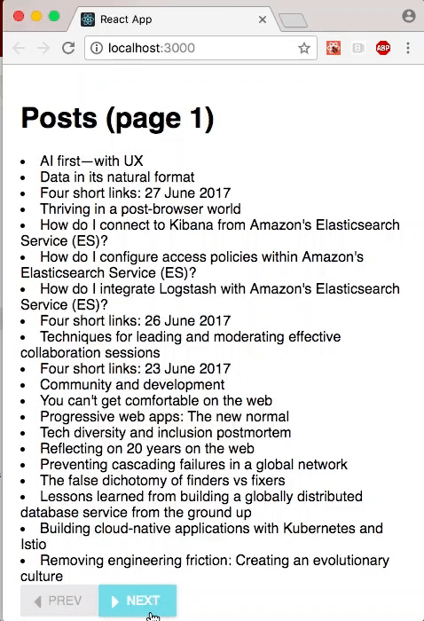

# DRAFT: Serverless on Google: Cloud Functions + React

[Cloud Functions](https://cloud.google.com/functions/) is Google's entry into the [serverless computing](https://en.wikipedia.org/wiki/Serverless_computing) craze.  The promise of the serverless architecture is to dramatically reduce the cost and complexity of developing, scaling, and operating a range of applications.  While there are still a host of issues to resolve, the potential benefits are enormous, especially for microservices, IoT, and mobile.

This article and [companion github repo](https://github.com/odewahn/cloud-functions-with-react) show how to use Cloud Functions as the backend for a React app that can be deployed as a static website.  While frameworks like [Serverless](https://serverless.com/) provide more features, such as built-in deployment and a variety of useful plugins, the approach presented here is a simple and quick way to get a basic frontend and backend up and running quickly.

The following sections will walk you through the set-up of a simple example that uses cloud functions to query an API (the list of articles on oreilly.com), and an accompanying React frontend that will let you page through the data.



The frontend will also show how to:

* Set up [redux](https://github.com/reactjs/redux), a library to manage your JavaScripts application state in a central datastore
* Set up middleware to load data from our backend; it also shows how to display a spinner while the data is being fetched
* Use the [material-ui](https://github.com/callemall/material-ui) framework to create a super simple UI
* Dispatch events to a web page through the API data

Before you start, you'll need to:

* Create a [google cloud account](https://cloud.google.com/)
* Install the [Google cloud SDK](https://cloud.google.com/sdk/) so that you can manage your cloud from the command line.
* Install (if you don't already have) [Node](https://nodejs.org/en/) version 6 or higher.
* Install (if you don't  already have) [create-react-app](https://github.com/facebookincubator/create-react-app), Facebook's awesome utility for bootstrapping, developing, and building React projects.
* Clone [odewahn/cloud-functions-with-react](https://github.com/odewahn/cloud-functions-with-react)  from GitHub, `cd` into it, and run `npm install`.

Once you've got these pieces in place, move on to the next section.

## Create a new gcloud project

Google Cloud organizes projects into, well, projects.  So the first step is to create a new one.  Since this is intended as a basic template to get started, I'll calling it `react-gcloud-template`:

```
gcloud projects create react-gcloud-template
```

This takes about 30-45 seconds.  Then you can set it to be the default project for all subsequent `gcloud` commands:

```
$ gcloud config set core/project react-gcloud-template
```

## Install and configure the Cloud Functions emulator

The [cloud functions emulator](https://github.com/GoogleCloudPlatform/cloud-functions-emulator) allows you to develop and test functions on your local computer, which vastly accelerates development speed.

```
npm install -g @google-cloud/functions-emulator
```

Once it's installed, set your new project:

```
functions config set projectId react-gcloud-template
```

Next, start the emulator:

```
functions start
```

Finally, deploy the `posts` function to the emulator, like this:

```
functions deploy posts --trigger-http
```

The `posts` function, which is the user's main entry-point for the example, is defined in the root level file `index.js` of the project directory, and uses the [node-fetch](https://www.npmjs.com/package/node-fetch) module to grab a page-by-page list of articles from oreilly.com:

```
var fetch = require("node-fetch");
const cors = require("cors")();

//===========================================================================
// Get the topic types from ORM site
//===========================================================================
exports.posts = (req, res) => {
  // Parse the body to get the passed values
  var params;
  try {
    // try to parse the body for passed parameters
    params = JSON.parse(req.body);
  } catch (e) {
    // provide default values if there is an error
    params = { page: 1 };
  }
  // Wrap function in a CORS header so is can be called in the browser
  cors(req, res, () => {
    // Lookup the account type based on the email.
    fetch(
      "https://gateway.oreilly.com/clients/website/feed/all/page/" +
        params["page"],
      {}
    )
      .then(res => {
        return res.json();
      })
      .then(data => {
        res.send(data["posts"]);
      });
  });
};
```

Two small but important things to observe.  First, note how the return function is wrapped in a `cors` function call; this adds the headers required to get around the browser's [cross-origin security restrictions](https://developer.mozilla.org/en-US/docs/Web/HTTP/Access_control_CORS).  Without these headers, you'll get this error on any AJAX/fetch call from the browser:  

```
Fetch API cannot load http://localhost:8010/react-gcloud-template/us-central1/posts. No 'Access-Control-Allow-Origin' header is present on the requested resource. Origin 'http://localhost:3000' is therefore not allowed access. If an opaque response serves your needs, set the request's mode to 'no-cors' to fetch the resource with CORS disabled.
```

Second, notice how we're only returning a part of the data we get back (just the values in `data["posts"]`).  This shows how we can use the Cloud Function to transform a raw API call, which can be valuable when you're developing microservices against a larger API infrastructure.

Here's an example of how to use [httpie](https://httpie.org/) to call the function from the command line.  The value returned is a JSON-formatted array of hashes; each hash contains the data for a post:

```
http -b http://localhost:8010/react-gcloud-template/us-central1/posts page=1

[
    {
        "byline": {
            "authors": [
                {
                    "first-name": "Hadi",
                    "last-name": "Hariri",
                    "url": "/people/7fd97-hadi-hariri"
                }
            ]
        },
        "dek": "Learn how Kotlin functions easily accept default and multiple parameters.",
        "permalink": "https://www.oreilly.com/learning/simple-functions-in-kotlin",
        "title": "Simple functions in Kotlin"
    },
    ...
]
```

You can also add new functions to `index.js`, using `posts` as a template.  Just be sure that you deploy each one individually (i.e., `functions deploy yourNewFunction --trigger-http`).  Once deployed, all your changes will be "live" in the emulator each time you update and save the file, so that you'll be executing the new code once you call the function again.  This is a huge time savings compared to having to deploy the function directly to Google Cloud, and one of the key strengths of using the `functions` emulator.


## Deploying your function to Google Cloud

Once your function is works, you can deploy it to Cloud Functions (versus just the emulator).  To do this, you'll need to enable billing and Cloud Functions in the [cloud console](https://console.cloud.google.com).

After you've enabled everything, create a [cloud storage bucket](https://cloud.google.com/storage/docs/json_api/v1/buckets) where your code will be uploaded.  (This bucket will also have the `node_modules` folder for all your dependencies.) Go into the console and create a bucket where your code where your code can be uploaded to gcloud.  Alternatively, you can also use [gsutil](https://cloud.google.com/storage/docs/gsutil) tool, a command line utility for working with gCloud:

```
gsutil mb -p react-gcloud-template gs://react-gcloud-template-deploy
```

In either case, you must use a globally unique bucket name.  I called mine `ano-auth-test-bucket`.
(If you get an error like `AccessDeniedException: 403 The account for bucket "react-gcloud-template-deploy" has been disabled` you need to enable billing on the project in the console.)

Remember to run `npm install` to download any dependencies. Then you’re ready to deploy your application in the cloud):

```
gcloud beta functions deploy posts --stage-bucket react-gcloud-template-deploy --trigger-http
```

That will produce a log like this:

```
Copying file:///var/folders/hj/x05v_3s544n68fqr31pxsjwr0000gn/T/tmpFaEd0v/fun.zip [Content-Type=application/zip]...
/ [1 files][  3.9 MiB/  3.9 MiB]                                                
Operation completed over 1 objects/3.9 MiB.                                      
Deploying function (may take a while - up to 2 minutes)...done.                                                       
availableMemoryMb: 256
entryPoint: posts
httpsTrigger:
  url: https://us-central1-react-gcloud-template.cloudfunctions.net/posts
latestOperation: operations/cmVhY3QtZ2Nsb3VkLXRlbXBsYXRlL3VzLWNlbnRyYWwxL3Bvc3RzLzNfQXlBNGR2LUhN
name: projects/react-gcloud-template/locations/us-central1/functions/posts
serviceAccount: react-gcloud-template@appspot.gserviceaccount.com
sourceArchiveUrl: gs://react-gcloud-template-deploy/us-central1-posts-unmlnlxxrudy.zip
status: READY
timeout: 60s
updateTime: '2017-06-28T14:18:12Z'
```

The `httpsTrigger` section of the log has the URL for the deployed function:

```
http https://us-central1-react-gcloud-template.cloudfunctions.net/posts
```

If you forget this link, you can always recover it like this:

```
$ gcloud beta functions list
NAME   STATUS  TRIGGER
posts  READY   HTTP Trigger
```

And then `describe` it, like so:

```
$ gcloud beta functions describe posts
availableMemoryMb: 256
entryPoint: posts
httpsTrigger:
  url: https://us-central1-react-gcloud-template.cloudfunctions.net/posts
latestOperation: operations/cmVhY3QtZ2Nsb3VkLXRlbXBsYXRlL3VzLWNlbnRyYWwxL3Bvc3RzLzNfQXlBNGR2LUhN
name: projects/react-gcloud-template/locations/us-central1/functions/posts
serviceAccount: react-gcloud-template@appspot.gserviceaccount.com
sourceArchiveUrl: gs://react-gcloud-template-deploy/us-central1-posts-unmlnlxxrudy.zip
status: READY
timeout: 60s
updateTime: '2017-06-28T14:18:12Z'
```

## Set up the React frontend


Once you've set up the backend functions, you're ready to tackle the frontend.  If you're starting completely from scratch (as opposed to cloning from an existing project), you'll need [create-react-app](https://github.com/facebookincubator/create-react-app), a tool from Facebook that claims to let you "create React apps with no build configuration."  Basically, it's an opinionated way to structure your projects and tools.

```
npm install -g create-react-app
```

If you haven't already, run `npm install` to download all your dependencies into the `node_modules` directory.  

Once `npm install` completes, run `npm start` to fire up the app.  Note that you may need to modify the URL in `src/state/posts.js` to match your functions emulator:

```
return fetch(
  "http://localhost:8010/react-gcloud-template/us-central1/posts",
  {
    method: "POST",
    body: JSON.stringify({
      page: getState().Posts.get("page")
    })
  }
)
```

From then on, you can make changes in the React app and thanks to the magic of `create-react-app`, you'll get immediate hot reloading for your project.

A quick description follows of how the project is organized:

* All the frontend code is in the `src` directory, which is the default from `create-react-app`
* The main entry point, `src/App.js`, sets up the `redux` store and the [redux-thunk](https://github.com/gaearon/redux-thunk) middleware.  Redux, a library by Dan Abramox, allows you to centralize your application state and all logic that alters that state into one central store, leading to more maintainable code.
* The `src/state` directory has all the redux stores.  I like to use `combine-reducers` so that I can break out the state tree into logical units.  With that structure, you can easily add a new kind of state objects (for example, a `content` store with the contents of a post) by putting it in a new file (you can use `src/state/posts.js` as a template) and adding it into the combined reducers in `srs/state/index.js`.
* All the state logic for this sample is in `src/state/posts.js`.  In addition to the ability to dispatch a thunk that retrieves data from the cloud function, I've also set up logic to control a spinner/progress meter.  In production code, you'd want to also do things like handling errors, but that's beyond the scope of this article.
* The main UI component is in `src/components/posts.js`.  This shows how to use the [material-ui](https://github.com/callemall/material-ui) toolkit to make a simple UI that consists of a list based on the API results, along with a couple of nav buttons to page though the results.

Once you're ready to deploy the React app, you can run `npm run build`, unpo which `react-create-app` will create a compiled, minified app in a `build` directory that is ready to publish as a static site.  For example, you could commit the files in `build` to the top level of a `gh-pages` branch of a new project and publish your app with GitHub pages.

## Conclusion

The combination of the serverless architecture with a React frontend published as a static site is a great way to quickly spin up new applications with minimal administrative overhead.  However, serverless really shines for quickly deploying microservices and IoT or mobile backends.  The superior economics of cloud functions over traditional hosting present many exciting opportunities, so watch this space carefully.
